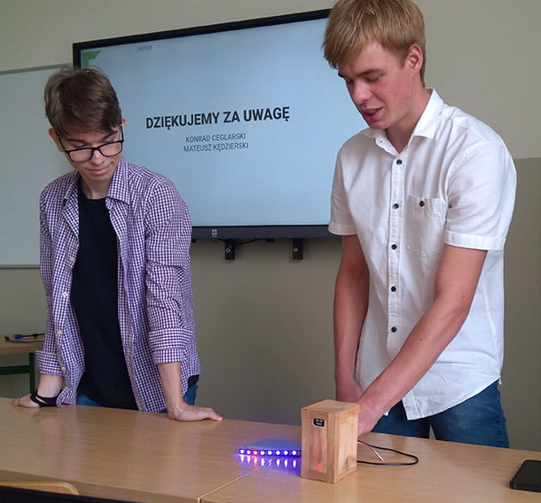

[ARCHIVE PROJECT @ 2020]

# SMART LEDS 💡
**Zespół Szkół Elektroniczno-Telekomunikacyjnych w Lesznie 🎓** \
2020, 2nd Year \
Project summarizing the Internship \
by **Konrad Ceglarski** & [**Mateusz Kędzierski**](https://www.youtube.com/@MattechPC)
<!--  -->
<!-- 
 -->

## About
**Long story short:** little contraption to manage the LED lightning. \
**In more detail:** brain, that got to be an **ESP8266** encapsulated in a wooden case with a puropuse to host a server with an app through out you could manage the LED stripe.

## Acknowledgments
- [Toblum's McLightning](https://github.com/toblum/McLighting) — main project inspiration
- [Tzapu's WiFi Manager](https://github.com/tzapu/WiFiManager) — wi-fi manager used in project

## Archive Photo

